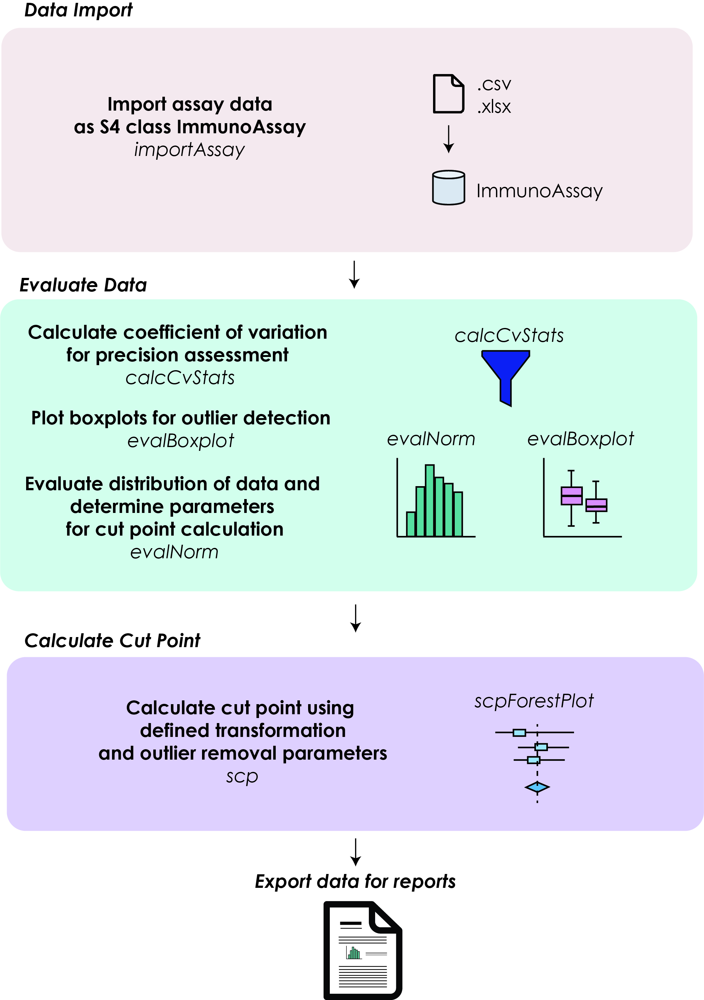

```{r setup, include=FALSE}
#knitr::opts_chunk$set(echo = FALSE, message = FALSE, warning = FALSE)
knitr::opts_chunk$set(warning = FALSE)
knitr::opts_chunk$set(cache=TRUE)
```

# Introduction

Evaluating the immunogenicity of biologics is a critical step in the drug development process. Non-clinical and clinical immunogenicity is evaluated via detection of treatment-induced anti-drug antibodies (ADAs). This assessment is often done using screening cut point determination through a multi-tier process. The screening cut point establishes the line between ADA negative and potentially positive samples. While there are well-established guidelines for determining the screening cut point of immunoassays [@RN15; @RN41], many tools are either incomplete or are not available for widespread use.

`rADA` is an R package that provides an open-source solution for screening cut-point determination that can be used to simplify the process of ADA detection as well as provide a framework for reproducibility and easily generate figures for reports. `rADA` offers the following key features summarised in the diagram below.


<br><br>
<center>
{width=50%}
</center>

<br> <br>

In this vignette, the functions in the R package `rADA` will be used to evaluate data from immunoassays and calculate the screening cut point as well as produce plots that may be useful in further assessment of the data. Note that the confirmatory cut-point determination is not implemented in the `rADA`.

# Installation

`rADA` can be installed from CRAN or the repository:

```{r, eval=FALSE}

# Current version
install.packages('rADA')

# Development version
devtools::install_github('egmg726/rADA')

```


# Load Libraries

The following libraries are needed to calculate screening cut point and produce plots. To load these libraries, type in the R console:

```{r, message=FALSE}

library(rADA)
library(forestplot)
library(ggplot2)
library(grid)
library(gridExtra)
library(reshape2)

```

# Read file


The `rADA` package includes a `lognormAssay` dataset which is generated based on the log-normal distribution. The parameters of this simulated dataset are based on observed datasets by the authors. To load the dataset, use:


```{r}

data(lognormAssay)

```


To upload your own data from your local hard drive, use an appropriate data import function designated to read the data format. For example, the data stored in Comma Separated Values (.csv) files can be read in R using the `read.csv` function and the Excel (.xlsx) files can be read using the `read.xlsx` function in the `openxlsx` package (make sure all of your data is on a single sheet). For more information and help on uploading xlsx files in R, refer to the `openxlsx` documentation [add hyperlink to openxlsx documentation] .

As a minimum, your file should contain at least 3 columns: ID, Lot, and data column.

Currently, your data column(s) should be identified by the following identifiers: DayID_OperatorID_ReplicateID. While the IDs do not have to necessarily be in a particular format, they should be consistent across all columns as well as distinct from each other. For instance, if '1' is used to denote the replicate number 1, you should use 'D1' to designate your day 1 instead of '1'.

For the `lognormAssay` dataset, the simulated experiment is based on a design of 3 replicates performed by 2 separate operators over 3 days as follows:


```{r}
head(lognormAssay)
```

After loading/uploading the data, the next step is to assign the data to an `ImmunoAssay` object in order to perform the analysis as this will be the class that will be accepted by most of the functions in `rADA`.

```{r}

assay.obj <- importAssay(lognormAssay, exp.name = 'Experiment1')

```

The `exp.name` argument holds the name of the experiment (default is `Experiment1`) and can be changed if required.

The data is imported as is and in a reformatted version in the `data` and `melted.data` slots. This melted version of the data is used for the downstream functions of `rADA`. (To read more about melting data.frames, see the `reshape2` documentation [here](https://CRAN.R-project.org/package=reshape2)) However, the function specific to `rADA` will also extract the analytical variables as well from the column names defined.


# Calculate Mean, SD, and CV%

The coefficient of variation (CV) can be calculated by using the `calcCvStats` function. The CV is used to test the variability between replicates. If a replicate falls outside of the established range, it can be excluded from the final analysis. The default value for the CV in this function is 20%, though this can be changed within the function.

```{r}

assay.obj <- calcCvStats(assay.obj)

```

This function produces a list of dataframes that can be used for the remainder of the analysis.

```{r}
names(assay.obj@stats)
```


This function produces dataframes that summarize the values calculated in the function. This is a way for the user to see how many samples were outside the defined CV and if this is consistent across different potential analytical variables.

For instance, one can examine whether or not there were outliers calculated for replicates done on Day 1 done by Operator 2. 

```{r}

table(assay.obj@stats$is.adj.df$D1Op2)

```

Accordingly,  9/100 of the samples are outside the defined CV.

Similarly, the outlier examination can be done for replicates run on Day 2 by Operator 1.

```{r}

table(assay.obj@stats$is.adj.df$D2Op1)

```

There seems to be more variability between the replicates of the values generated on this day by this operator. This will be something to keep in mind for the further evaluation of the dataset.


Once this analysis is completed, the `melted.data` slot is replaced with a copy of the original (melted) dataset with all of the outliers removed. This can then be used as input for the rest of the pipeline. 


```{r}

head(assay.obj@melted.data, n = 7)

```


The `melted.data` includes columns that represent the days, operators, and replicates. This type of format makes it easier to create plots for visualization as well as group the data by the analytical variables of interest.


# Boxplots of Days/Operators

While an examination of the CV is helpful to understand the variability within the dataset, a better way of looking at the dataset is through the evaluation of the distribution using boxplots.

The `evalBoxplot` function will produce the boxplot of the signal for a given experiment variable. For example, the signal differences between days can be visualized using:


```{r}

evalBoxplot(assay.obj, var = 'Day')

```


This can be helpful when you are comparing between different experiments as `evalBoxplot` will separate the values by experiment that experimental variable.

Note that the other options to input into the `var` variable are "Operator", "Replicate", or "Day". The `evalBoxplot` uses `ggplot2` functionalities. Therefore, any additional `ggplot2` argument can be passed to the function for better customization. In this instance, the plot theme is adjusted using `theme_minimal()`.


```{r}

evalBoxplot(assay.obj, var = 'Operator') + theme_minimal()

```

In order to differentiate between different variables, the color adjustments can be applied:

```{r}

evalBoxplot(assay.obj, var = 'Replicate') + ggplot2::theme_minimal() + ggplot2::scale_fill_manual(values='#00a4b2')

```

Further customization can be done using `ggplot2` functionalities. For more information, refer to the website [here](https://ggplot2.tidyverse.org/index.html).


## Evaluating the distribution of the dataset

Histograms along with boxplots are commonly used to evaluate the distribution of the data. This section will provide the R code to re-create a figure from the original white paper [@RN15]. The following code will create a composite of a histogram and a boxplot:


```{r}

# Create the boxplot for the top of the plot
p1 <- ggplot(assay.obj@melted.data, aes(x=Category,y=value)) + stat_boxplot(geom ='errorbar',width=0.2, size = 1.5) +geom_boxplot(size = 1.1) + coord_flip() +  scale_y_continuous(limits = c(0, 40)) +
    theme(
        axis.title=element_text(size=12,face="bold"),
       panel.background = element_blank(), 
       panel.grid = element_blank(),
       axis.title.y = element_blank(),
       axis.title.x = element_blank(),
       axis.ticks.x=element_blank(),
       axis.ticks.y=element_blank(),
       panel.border = element_rect(colour = "black", fill=NA, size=2),
       axis.text.x=element_blank(),
       axis.text.y=element_blank())


# Create the histogram for the bottom of the plot
p2 <- ggplot(assay.obj@melted.data, aes(x=value)) + geom_histogram(aes(x = value, y = ..density..), colour="black", fill="#6c78a7", size = 2) +  scale_x_continuous(limits = c(0, 40)) +
  stat_function(fun = dnorm, args = list(mean = mean(assay.obj@melted.data$value, na.rm = TRUE), sd = sd(assay.obj@melted.data$value, na.rm = TRUE)), size = 2) +
  theme(
        axis.title=element_text(size=12,face="bold"),
        panel.border = element_rect(colour = "black", fill=NA, size=2),
       panel.background = element_blank(), 
       panel.grid = element_blank())

```


The histogram and the boxplot can be put together in the same  viewport using functions from `grid` and `gridExtra` libraries as follows:

```{r}

grid.newpage()
grid.draw(rbind(ggplotGrob(p1), ggplotGrob(p2), size = "last"))

```

As seen, the distribution of the data is skewed to the right.

# Normality Evaluation

The `rADA` offers normality evaluation using Shapiro – Wilk’s normality test [@RN80] with the `evalNorm` function. Using `evalNorm`, the normality can be assessed using the original untransformed data, transformed data, with or without outliers.

The function take the following arguments:

* `assay.obj`: An ImmunoAssay object imported by importAssay
* `category`: If assay.df.melted consists of more than 1 dataset, choose the category here to split dataset
* `data.transf`: Should the data should be transformed before normality is evaluated
* `transf.method`: If data.transf is TRUE, which method should be used. Can choose between 'log10' and 'ln'.
* `excl.outliers`: Should outliers be excluded from this analysis?  If TRUE, data points which lie beyond the extremes of the whiskers in boxplot will be excluded, see boxplot.stats for details.
* `hist`: Should a histogram be outputted? TRUE/FALSE
* `p.val`: Value to be used for cutoff for Shapiro-Wilks test. Defaults to 0.05.
* `skew`: Value to be used to determine skewness. Defaults to 1.
* `return.object`: If FALSE, only the plot is returned and the stats are returned as a list.

## No Outlier Removal

The evaluation of the normality in the untransformed (original) values can be done using ` data.transf = FALSE ` argument in `evalNorm`.

```{r}


evalNorm(assay.obj = assay.obj, category = 'Experiment1', data.transf = FALSE, return.object=FALSE)

```

As seen, when the data has not been transformed, the distribution is positive skewed.

Now, the data can be transformed using log10 to see if the transformed data follows a normal distribution. The `data.transf = TRUE` and `transf.method = 'log10'` can be used for this purpose. Note that, if there are multiple experiments, the experiment name for the category variable can be specified accordingly.


```{r}


assay.obj <- evalNorm(assay.obj = assay.obj, category = 'Experiment1', data.transf = TRUE, transf.method = 'log10')


```


The normality evaluation function adds additional stats to the `stats` slot of the `ImmunoAssay` object:

```{r}

names(assay.obj@stats)

```


* `transformation` a string containing the transformation method used, "None" will be displayed if `data.tranf = FALSE`
* `sw.results` the output of `shapiro.test()`, this output is used for the recommendation
* `skewness` the skewness value used in order to make the recommendation
* `recommendation` a string containing the official recommendation of the function, may be used as input for `scp()` function 

Additionally, this produces a histogram of the dataset which should be used in order to confirm or reject the recommendation that has been offered by the function.

The recommendation made by this function can be used to make a final decision on the statistical methodology (i.e. parametric or non-parametric) used for the screening cut-point  determination as explained in Shankar, 2008. If you are satisfied with the recommendation, it can be used in the next stage of screening cut-point determination. 

Accordingly, after the log10 transformation on the data, it is recommended to use a parametric method for screening cut point determination.

```{r}

# Results from the Shapiro-Wilks test
print(assay.obj@stats$sw.results)

# Calculated skewness value
print(assay.obj@stats$skewness)

# Recommendation based on the previous 2 values
print(assay.obj@stats$recommendation)

```


## Outlier Removal

If required, the normality can be assessed by removing the outlying values in the data. When the `excl.outliers` argument is set as `TRUE`, the normality assessment is done by removing outliers in the data.

```{r}

assay.obj <- evalNorm(assay.obj = assay.obj, category = 'Experiment1', data.transf = FALSE, excl.outliers = TRUE)

```

Note that the outliers are not removed from the data at this point and need to be removed (if needed) in the next step.


# Calculate Cut Point

Once the normality of the distribution and logarithmic transformations are tested on the data the next step is to calculate the screening cut point using the recommendation.

Since this data is skewed without data transformation and outlier removal, the distribution can be characterized  as "nonparamateric" and the screening cut-point can be found using the non-parametric approach explained in @RN15 as follows:


```{r}

assay.obj <- scp(assay.obj = assay.obj,
    category = 'Experiment1',
    distrib = 'nonparametric',
    data.transf = FALSE,
    rm.out = FALSE)

print(assay.obj@scp.table)

```

By default, the `scp` function divides up the cut point calculations by the experimental variables (i.e., operators and days)  used in the immunoassay experiment in order to provide 
better understanding on how the screening cut point may differ between experimental groups. The last line (named `all`) will provide the overall cut point estimation and the 95% confidence interval for the estimation.

Based on this data and the boxplots generated earlier, since there is not a substantial difference among cut-points, this is indicative of minimal influence of analytical variability. The same calculation can be carried out based on the transformed data and the influence on the results can be compared. This way the calculations can be compared systematically to see how data transformation has affected the cut point calculation.

Using the most suitable parameters that is determined from normality evaluation, the screening cut-point calculation can be undertaken using the log10 transformed data and be saved in a table named `cp.table`.


```{r}

assay.obj <- scp(assay.obj = assay.obj,
                category = 'Experiment1',
                distrib = 'normal',
                data.transf = TRUE,
                transf.method = 'log10',
                rm.out = FALSE)

print(assay.obj@scp.table)

```

As seen from the output, the calculated cut points are different between the two different methods chosen.

The columns in this table are slightly different compared to those in the previous cut point table we generated since we transformed the data. Instead of just one `cp`, there is an additional cut point called `cp.inv`. This is the inverse cut point that corresponds to the actual dataset.

There are two confidence intervals calculated: one for the mean and one for the screening cut point. The 95% confidence intervals are also calculated here. Since the cut point is an unknown parameter, this is the range where we can be 95% confident the parameter falls between. The smaller the range, the more confident we can be that the calculated cut point is close to the real value. In this case, the confidence intervals are relatively close to each other.


## Forest Plot of Cut Points

A forest plot can help visualize the data generated from the table of calculated cut points. This type of plot will also be useful when comparing between different methods of cut point calculation (such as outlier inclusion/exclusion and various data transformation methods.)

In this case, it can be seen that there is an overlap using the 95% confidence intervals that were calculated in the `scp` function beforehand.

For further explanation of the input and variables for the `forestplot` function, please refer to [the package documentation](https://CRAN.R-project.org/package=forestplot) from the `forestplot` package.


```{r}

scpForestPlot(assay.obj)

```

The forest plot suggests that while there is slight variation in the cut point separated by day/operator, the values are all relatively close to each other with the 95% confidence intervals all overlapping with each other.

## Analysis of Variance

```{r}

assay.df.melted <- assay.obj@melted.data
mod <- aov(value ~ DayOperator, data=assay.df.melted)
aov.p <- summary(mod)[[1]][[1,"Pr(>F)"]]

varhom <- car::leveneTest(value ~ DayOperator, data=assay.df.melted)
levene.p <- varhom$`Pr(>F)`[1]

data.frame(aov=aov.p, levene=levene.p)

```


## The effect of different methodologies on the cut point estimation


```{r}

scp.compare <- data.frame()

for(distrib in c('normal','nonparametric')){
  for(exclOut in c(T,F)){
  for(dataTransf in c(T,F)){

      if(dataTransf == TRUE){
        for(transfMeth in c('log10')){
  
          
                 assay.obj2 <- scp(assay.obj = assay.obj,
                category = 'Experiment1',
                distrib = distrib,
                transf.method = transfMeth,
                data.transf = dataTransf,
                rm.out = exclOut)
    
    scp.row <- assay.obj2@scp.table[nrow(assay.obj2@scp.table),]
    
    if('cp.inv' %in% colnames(scp.row)){
      cp.row <- scp.row[,'cp.inv']
    } else {
      cp.row <- scp.row[,'cp']
    }
    
    scp.compare <- rbind(scp.compare, data.frame(cp=round(cp.row,digits=3), distrib=distrib,excludeOutliers=as.character(exclOut),dataTransformed=as.character(dataTransf), transfMethod=transfMeth))
          
          
  
        }
    
      } else {
        
            assay.obj2 <- scp(assay.obj = assay.obj,
                category = 'Experiment1',
                distrib = distrib,
                data.transf = dataTransf,
                rm.out = exclOut)
    
    scp.row <- assay.obj2@scp.table[nrow(assay.obj2@scp.table),]
    
    if('cp.inv' %in% colnames(scp.row)){
      cp.row <- scp.row[,'cp.inv']
    } else {
      cp.row <- scp.row[,'cp']
    }
    
    scp.compare <- rbind(scp.compare, data.frame(cp=round(cp.row,digits=3), distrib=distrib,excludeOutliers=as.character(exclOut),dataTransformed=as.character(dataTransf), transfMethod='NA'))
        
      }
    
    
  }
  } 
}

scp.compare


```


# References

<div id="refs"></div>

# Session Info

```{r}

sessionInfo()

```


